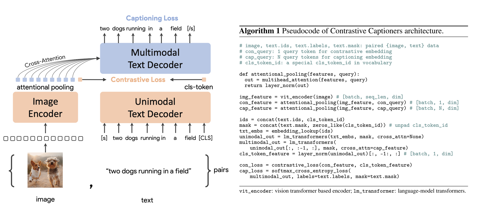

# [CoCa: Contrastive Captioners are Image-Text Foundation Models](https://arxiv.org/pdf/2205.01917.pdf)

## Introduction

- foundation models with single encoder using cross entropy loss:
  - [Rich feature hierarchies for accurate object detection and semantic segmentation](https://arxiv.org/abs/1311.2524)
  - [Fully convolutional networks for semantic segmentation](https://arxiv.org/abs/1411.4038)
  - [Two-stream convolutional networks for action recognition in videos](https://arxiv.org/abs/1406.2199)

    These models only reply on annotation vectors, not using free form human knowledge.

- image-text foundation models using dual-encoder models with a contrastive loss: 
  - [Learning Transferable Visual Models From Natural Language Supervision](https://arxiv.org/abs/2103.00020)
  - [Scaling up visual and vision-language representation learning with noisy text supervision](https://arxiv.org/abs/2102.05918)
  - [Florence: A new foundation model for computer vision](https://arxiv.org/abs/2111.11432)
  
  However, this line of models cannot be directly applicable to joint visual-language understanding tasks, such as VQA.

- Another line of research explored generative pretraining with encoder-decoder (during pre-training, the encoder takes image as input and applied LM/prefix LM loss on the decoder side):
  
    - [Show and Tell: A Neural Image Caption Generator](https://arxiv.org/abs/1411.4555)
    - [Simvlm: Simple visual language model pretraining with weak supervision](https://arxiv.org/pdf/2108.10904.pdf)

## Related work

  - CLIP is an example of using dual encoder with contrastive loss

  

## Approaches

  